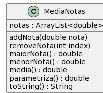

# Descrição  

A classe `MediaNotas` armazena um conjunto de notas com os seguintes atributos e métodos:

## Atributos:
- `ArrayList<Double> notas`: Armazena as notas inseridas.

## Métodos:
- `addNota(double nota)`: Adiciona uma nova nota à lista de notas.
- `removeNota(int index)`: Remove a nota com o índice `index`. Caso o índice seja inválido, a mensagem **"Falha: índice inválido"** será exibida.
- `maiorNota()`: Retorna a maior nota. Caso não haja notas, imprime a mensagem **"Falha: quantidade de notas insuficiente"**.
- `menorNota()`: Retorna a menor nota. Caso não haja notas, imprime a mensagem **"Falha: quantidade de notas insuficiente"**.
- `double media()`: Retorna a média das notas.
- `double parametriza()`: Todas as notas são divididas pela maior nota e multiplicadas por 10.

## Diagrama


**Shell Interativo**:

```bash
$addNota 8
$addNota 9
$addNota 7
$show
[8.00, 9.00, 7.00]
$media
8.00
$parametriza
$show
[8.89, 10.00, 7.78]
$media
8.89
$addNota 7
$addNota 6
$show
[8.89, 10.00, 7.78, 7.00, 6.00]
$media
7.93
$parametriza
$show
[8.89, 10.00, 7.78, 7.00, 6.00]
$media
7.93
$end
